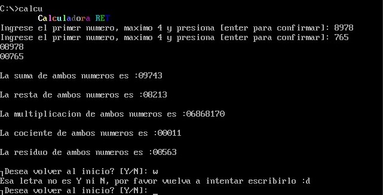

# Assembly-language
Lenguaje ensamblador para arquitectura Intel x86
Turbo Assembler (TASM)

# First Project 1
## Calculadora

- Suma
- Resta
- Multiplicacion
- Division
- Modulo
# Second Project 2
## Calculadora Grafica
![imgn] (/project2/img/suma.png)
